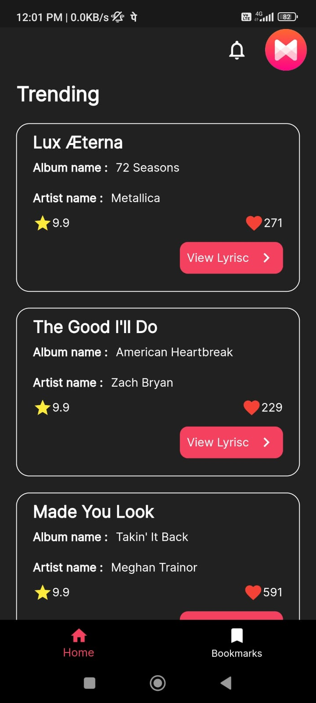
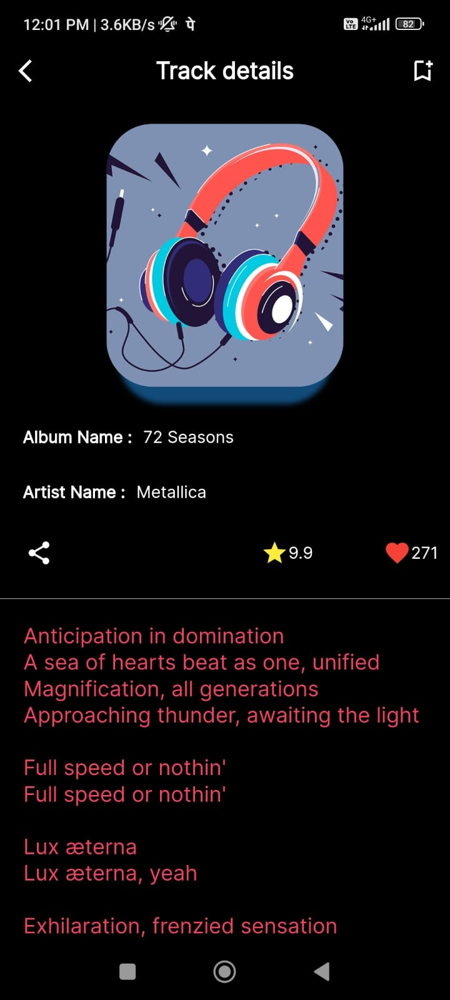
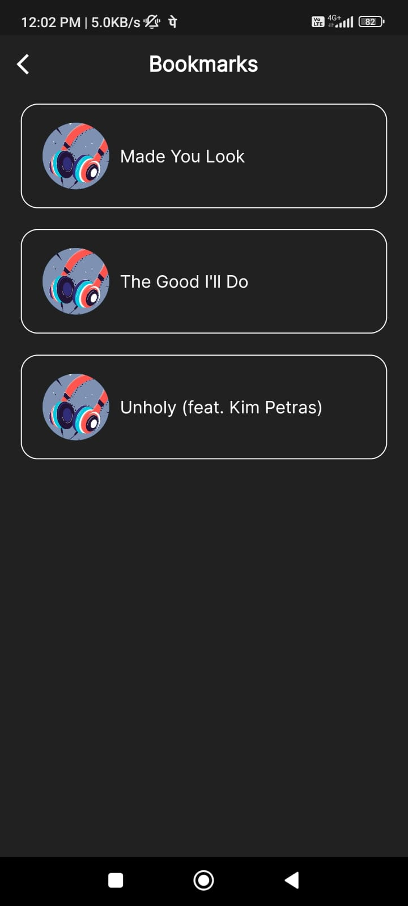

# MusixMatch
Lysric finder Application

# API key 
before starting the application you need API key from musixMatch

https://developer.musixmatch.com/

# Setup environment

- create .env file in project directory
- add API_KEY=$API_KEY

# Project Structure

- core: Contains configuration for application globally
- gen: Auto generate files (build_runner)
- presentation: Contains Stateful UI Screen,Widgets and Blocs for State management
   - Bloc
   - Widgets
   - Pages
- repo: Contains Data models and Data sources and their implementations
- routing: All the routing configuration(using Auto_route package)

# Build package
`dart run build_runner watch --delete-conflicting-outputs`

# Release 

`flutter build apk --release`

# Output

